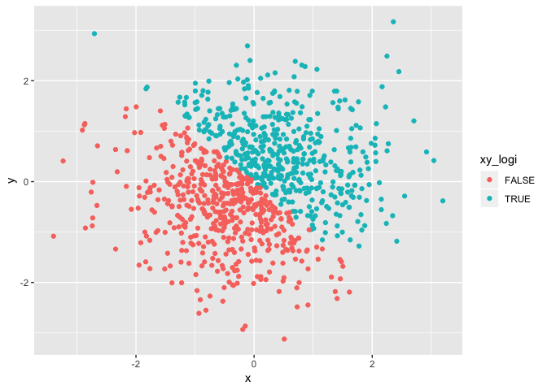
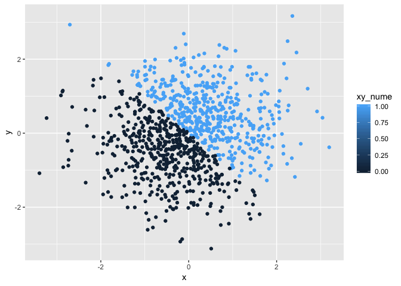
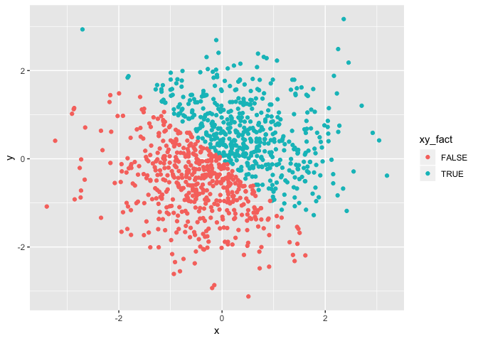

P8105\_hw1\_cz2544
================
Triciazhai
9/13/2018

Problem\_1
==========

1.1 Create a data frame comprised of:
-------------------------------------

-   A random sample of size 10 from a uniform\[0, 5\] distribution
-   A logical vector indicating whether elements of the sample are greater than 2
-   A (length-10) character vector
-   A (length-10) factor vector

``` r
library(tidyverse)
```

    ## -- Attaching packages --------------------------------------------------------------------------- tidyverse 1.2.1 --

    ## <U+221A> ggplot2 3.0.0     <U+221A> purrr   0.2.5
    ## <U+221A> tibble  1.4.2     <U+221A> dplyr   0.7.6
    ## <U+221A> tidyr   0.8.1     <U+221A> stringr 1.3.1
    ## <U+221A> readr   1.1.1     <U+221A> forcats 0.3.0

    ## -- Conflicts ------------------------------------------------------------------------------ tidyverse_conflicts() --
    ## x dplyr::filter() masks stats::filter()
    ## x dplyr::lag()    masks stats::lag()

``` r
hw1_df1 = tibble(
  vec_samp = runif(10, min=0, max=5),
  vec_logi = vec_samp > 2,
  vec_char = head(month.abb, 10),
  vec_fact = factor(c("cold", "cold", "cool", "warm", "warm", "hot", "hot", "hot", "cool", "cool"))
)
hw1_df1
```

    ## # A tibble: 10 x 4
    ##    vec_samp vec_logi vec_char vec_fact
    ##       <dbl> <lgl>    <chr>    <fct>   
    ##  1    2.04  TRUE     Jan      cold    
    ##  2    3.96  TRUE     Feb      cold    
    ##  3    3.08  TRUE     Mar      cool    
    ##  4    3.87  TRUE     Apr      warm    
    ##  5    4.67  TRUE     May      warm    
    ##  6    2.82  TRUE     Jun      hot     
    ##  7    0.426 FALSE    Jul      hot     
    ##  8    1.89  FALSE    Aug      hot     
    ##  9    3.56  TRUE     Sep      cool    
    ## 10    2.39  TRUE     Oct      cool

1.2 Try to take the mean of each variable in the dataframe
----------------------------------------------------------

``` r
mean_vec = c(mean(hw1_df1$vec_samp), mean(hw1_df1$vec_logi), mean(hw1_df1$vec_char), mean(hw1_df1$vec_fact))
```

    ## Warning in mean.default(hw1_df1$vec_char): argument is not numeric or
    ## logical: returning NA

    ## Warning in mean.default(hw1_df1$vec_fact): argument is not numeric or
    ## logical: returning NA

``` r
mean_vec
```

    ## [1] 2.870014 0.800000       NA       NA

**Comment:**
Mean value could be achieved for numeric/logical vectors and date, date-time and time interval objects, but not for charactor and factor vectors. For logical vectors, true = 1, and false = 0.

1.3 Write a code chunk that applies the as.numeric function to the logical, character, and factor variables
-----------------------------------------------------------------------------------------------------------

``` r
as.numeric(hw1_df1$vec_logi)
as.numeric(hw1_df1$vec_char)
```

    ## Warning: NAs introduced by coercion

``` r
as.numeric(hw1_df1$vec_fact)
```

1.4 Convert your character variable from character to factor to numeric
-----------------------------------------------------------------------

``` r
as.factor(hw1_df1$vec_char)
```

    ##  [1] Jan Feb Mar Apr May Jun Jul Aug Sep Oct
    ## Levels: Apr Aug Feb Jan Jul Jun Mar May Oct Sep

``` r
as.numeric(hw1_df1$vec_char)
```

    ## Warning: NAs introduced by coercion

    ##  [1] NA NA NA NA NA NA NA NA NA NA

**Comment:**
When characters are converted to factors, r recognized every different character as a factor level. Characters cannot be converted to numbers, so 10 "NA"" is the result.

1.5 Convert your factor variable from factor to character to numeric
--------------------------------------------------------------------

``` r
as.character(hw1_df1$vec_fact)
```

    ##  [1] "cold" "cold" "cool" "warm" "warm" "hot"  "hot"  "hot"  "cool" "cool"

``` r
as.numeric(hw1_df1$vec_fact)
```

    ##  [1] 1 1 2 4 4 3 3 3 2 2

**Comment:**
When factors are converted to charactors, the will be process as words in "", no longer as different levels. Factor vecters can be converted to numeric vectoers, as r recognize different factor levels of n, numbers from 1 to n has been asigned to different levels of factors. When convert factor vectors to numeric vectors, the asigned numbers for facter will be the new value.

Problem\_2
==========

2.1 Create a data frame comprised of:
-------------------------------------

-   x: a random sample of size 1000 from a standard Normal distribution
-   y: a random sample of size 1000 from a standard Normal distribution
-   A logical vector indicating whether the x + y &gt; 0
-   A numeric vector created by coercing the above logical vector
-   A factor vector created by coercing the above logical vector

``` r
set.seed(1234)
hw1_df2 = tibble(
  x = rnorm(1000),
  y = rnorm(1000),
  xy_logi = x + y > 0,
  xy_nume = as.numeric(xy_logi),
  xy_fact = as.factor(xy_logi)
)
hw1_df2
```

    ## # A tibble: 1,000 x 5
    ##         x      y xy_logi xy_nume xy_fact
    ##     <dbl>  <dbl> <lgl>     <dbl> <fct>  
    ##  1 -1.21  -1.21  FALSE         0 FALSE  
    ##  2  0.277  0.301 TRUE          1 TRUE   
    ##  3  1.08  -1.54  FALSE         0 FALSE  
    ##  4 -2.35   0.635 FALSE         0 FALSE  
    ##  5  0.429  0.703 TRUE          1 TRUE   
    ##  6  0.506 -1.91  FALSE         0 FALSE  
    ##  7 -0.575  0.939 TRUE          1 TRUE   
    ##  8 -0.547 -0.224 FALSE         0 FALSE  
    ##  9 -0.564 -0.674 FALSE         0 FALSE  
    ## 10 -0.890  0.446 FALSE         0 FALSE  
    ## # ... with 990 more rows

2.2 Short description of vectors using inline R code, including:
----------------------------------------------------------------

-   the size of the dataset in numbers of rows and columns is 1000, 5,
-   the mean and median of x are -0.0265972 and -0.0397942
-   the proportion of cases for which the logical vector is TRUE is 0.498

2.3 Make a scatterplot of y vs x:
---------------------------------

color points using the logical, numeric and factor variables.

``` r
ggplot(hw1_df2, aes(x, y, color = xy_logi)) + geom_point() 
```



``` r
ggplot(hw1_df2, aes(x, y, color = xy_nume)) + geom_point() 
```



``` r
ggplot(hw1_df2, aes(x, y, color = xy_fact)) + geom_point()
```



**Comment:**
The color scale for logical and facter vectors are discrete, one color for each value. The color scale for numerical vector is a two color gradient. Although the numeric vector in this case has only two values, it is processed as a contineous variable by R.

2.4 Export first scatterplot
----------------------------

``` r
ggplot(hw1_df2, aes(x, y, color = xy_logi)) + geom_point() 
```


``` r
ggsave("hw1_df2_plot_1.pdf", path = "./plot")
```

    ## Saving 7 x 5 in image

{r setup, include=FALSE} knitr::opts\_chunk$set(echo = TRUE) \`\`\`
